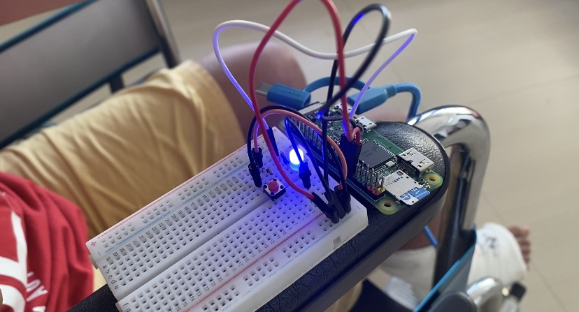
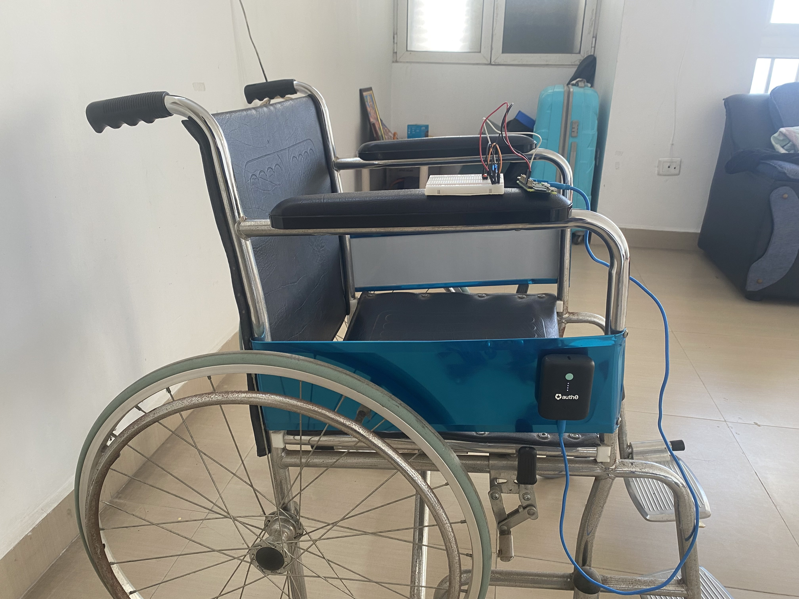
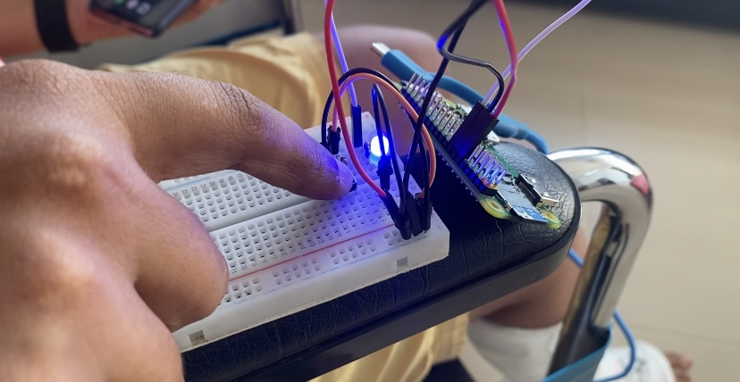
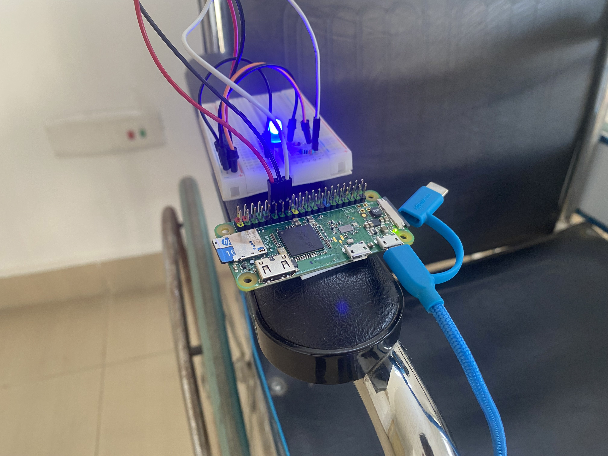
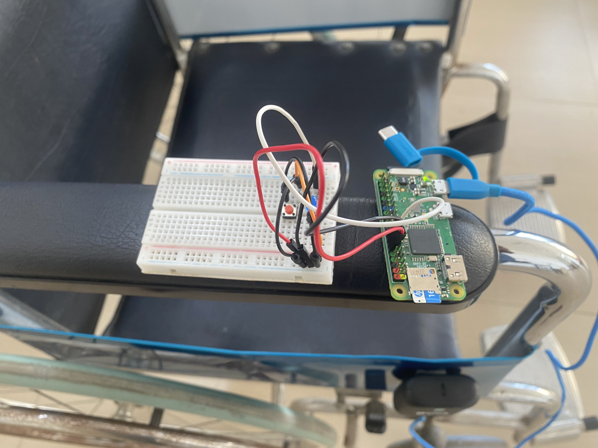

# Wheelie 🦽
Did you think a fractured leg would stop us from hacking?

## Inspiration💡
One of our developers got into an accident, fracturing their right leg, and has been advised to be on complete bed rest. They need assistance with moving around on a wheelchair and it's somewhat inconvenient to scream for help (really) and it's definitely a hassle when no one's around and they can't find their phone, so we decided to solve the problem using a Raspberry Pi Zero board laying around. With the push of a button now, they can reach out to their caretaker and ask them for help.

Plus, a broken bone can't stop us from hacking, so we hacked the problem. 🤷

## What it does 🧭
Wheelie consists of an RPi-based apparatus that sends a message to the caretaker(s) with a click of a button. The project harnesses the capabilities of the Twilio Console to interact with the hardware and send notifications effortlessly without having the user pick up their phone.

## How we built it 🔧
We used a Raspberry Pi Zero W board connected to a breadboard with a push-down button to create the hardware end of Wheelie. The Twilio credentials are hardcoded onto the Pi in the `raspberry-pi-code.py` file and `twilMsg` function is executed whenever the button on the apparatus is clicked, sending out notifications right away.

Even if Wheelie is disconnected from power, it starts the script on its own whenever the Raspberry Pi Zero boots up again eliminating the need to connect it to a laptop to initiate the script every single time.

## Challenges we ran into 🏃‍♂️
 1. Designing the hardware in a way that it's comfortable to attach to the wheelchair without creating a hassle for the user.
 2. Avoiding latency in sending out notifications through Twilio (remains unresolved as the dependency is on Twilio).

## Accomplishments that we're proud of 🏅
 1. The setup can be powered by a small power bank using just a USB Cable.
 2. It's super easy to create and attach a Wheelie on your own so folks who are facing similar issues can use it too. We've included all the necessary setup instructions over our GitHub Repository.
 3. Even if it's disconnected from power, it loads the required Python file as soon as power's back, without having to connect the apparatus to a computer again and restarting the application.
 4. sThe total cost of the apparatus is less than $10!

## What we learned 🧠
 1. Integrating Twilio with Pi.
 2. Setting up headless Raspberry Pi Zero.

## What's next for Wheelie ⏭
We did come up with a bunch of future iterations for our project, namely:
 - Using a GPS Dongle to geolocate the user and send the location as well with the SMS to the caretaker.
 - Using an LCD Display and a Keypad to provide multiple options to the user like "Get help", "Get food" and so on.
We'll be adding these integrations to Wheelie as soon as we receive the hardware components!